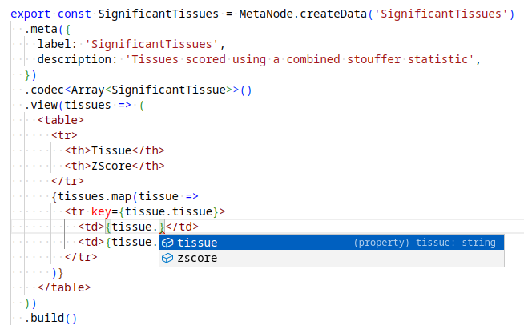
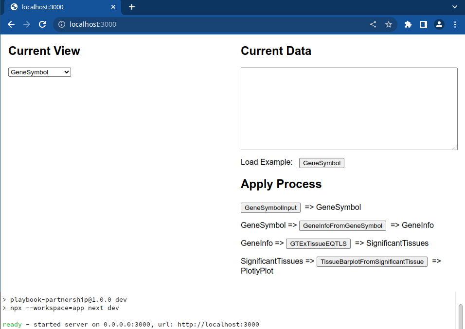

## Playbook Partnership Contribution Guide
Please review the [Background](./background.md) to better understand the concepts behind this repo.

### Who should contribute?
Anyone who wants to! Please create a pull request to add new content.

### Contribution Guide
Below is a guide to add a component to the playbook. You can additionally reuse the existing content in the registry and augment it for your own purposes.

1. Clone this repository and checkout a branch for your work.
    ```bash
    git clone https://github.com/nih-cfde/playbook-partnership/
    cd playbook-partnership
    git checkout -b my-new-component
    ```
2. For optimal coding experience, use an editor like [Visual Studio Code](https://code.visualstudio.com/) with rich typescript support. Open up the repository directory with it.
    
3. With [NodeJS](https://nodejs.org/) installed, install dependencies and start the development webui, this provides tools testing and debugging metanodes, the webserver will "hot-reload" when files are modified.
    ```bash
    npm i
    npm run dev
    ```
    
5. Add new components in directories under `components/`, potentially copying from an existing component. After adding a new component directory, be sure to execute `npm run prebuild` which adds it to the full graph.
6. Develop, test, and document your component, `index.tsx` should ultimately export your component's `metanodes`, see below for information describing how different types of Meta Nodes should be implemented.
7. Submit a pull request against the main branch.

### Anatomy of a Component

Components should have their own directory and minimally contain an `index.ts` (typescript) or `index.tsx` (typescript+react) file and a `package.json`. See subsequent sections about `index.tsx` depending on your MetaNode type.

The `package.json` is a standard by the javascript ecosystem and is used to capture the name (which should be the same as the directory), version, license, author, contributors, and npm dependencies.

`components/{mycomponent}/package.json`
```json
{
  "name": "mycomponent",
  "version": "1.0.0",
  "license": "CC-BY-NC-SA-4.0",
  "author": "Daniel J. B. Clarke <danieljbclarkemssm@gmail.com>",
  "contributors": [],
  "main": "index.tsx",
  "private": true,
  "dependencies": {},
  "devDependencies": {}
}
```

### Creating a Data Type / View
Each data type has a view, the view is a react component capable of meaningfully visualizing a given data type. Some views simply show the data, such as `Gene`, while others are more elaborate, such as `PlotlyPlot` which render a plot.

Its possible to write one from scratch, especially with the help of the typescript tab completion, but a view's basic structure is as follows:

`components/{DataType}/index.tsx`
```tsx
import React from 'react'
import { MetaNode } from '@/spec/metanode'

// a typescript type contract describing your data type
//  this is the "shape" of your data type
export type DataType = {
  mydatatype: string[]
}

export const Data = MetaNode.createData('Data')
  // This extra metadata will be used by the ultimate website, types should not have spaces or special symbols
  //  but labels can contain whatever. We may have additional attributes here in the future including
  //  icons, version, authorship information and more.
  .meta({
    label: 'My Data Type Human Label',
    description: 'A short description for my data type',
  })
  // The codec is responsible for the conversion of datatype => string and string => datatype
  //  the default (empty) uses JSON.stringify/JSON.parse and is usually adequate
  .codec<DataType>()
  // The view function is a react component for visualizing your data, the type will be the same
  //  as the type your provided to the codec, i.e. data has the properties defined in DataType
  .view(data => (
    <div>{JSON.stringify(data)}</div>
  ))
  // Finalize the metanode (currently does nothing, in the future might perform some additional validation)
  .build()

```

### Creating a Process
Each process has input types, an output type and an implementation. The two main process types are prompts and resolvers.

#### Prompt
A prompt allows the user to have control of the resulting output, and relies on the user to make some kind of decision or input some kind of data. If you only intend to visualize information without an output, you're looking for a DataType. You may need to create a resolver to resolve an existing datatype into a new datatype for which your specific visualization is attached.

`components/{PromptName}/index.tsx`
```tsx
import React from 'react'
import { MetaNode } from '@/spec/metanode'
import { GeneSymbol } from '@/components/Gene'

export const PromptName = MetaNode.createProcess('PromptName')
  // As with data types, we have metadata for the process
  .meta({
    label: 'Do something',
    description: 'A useful description',
  })
  // prompts *can* also take inputs like resolvers
  .inputs()
  .output(GeneSymbol)
  // the prompt function is a react component responsible for constructing the output based on
  //  user interaction. This output should be provided to the `submit` function passed as an argument
  .prompt(props => {
    // in practice, prompts may be modified after having already been submitted, thus
    //  the component should restore state if output is not undefined
    const [gene, setGene] = React.useState(props.output || '')
    return (
      <div>
        <input value={gene} onChange={evt => setGene(evt.target.value)} />
        <button onClick={evt => {
          // the submit callback produces the output of this node
          props.submit(gene)
        }}>Submit</button>
      </div>
    )
  })
  .build()

```

#### Resolver
A resolver is a data augmentation step which does not require direct user input. They can be made for APIs or data transformations.

`components/{ResolverName}/index.ts`
```ts
import { MetaNode } from '@/spec/metanode'
import { Gene } from '@/components/Gene'

export const ResolverName = MetaNode.createProcess('ResolverName')
  .meta({
    label: 'ResolverName',
    description: 'My resolver description',
  })
  // the map here uses the key which will be used in the resolve props, so
  //  because a Gene metanode is referenced with the key "gene",
  //  props.inputs.gene will contain data which conforms to the Gene codec specification
  .inputs({ gene: Gene })
  .output(Gene)
  // resolvers return a promise, they should resolve to data in a form that is compatible with
  //  the output codec specification. Typescript will enforce this and will have a red underline
  //  if things are wrong.
  .resolve(async (props) => {
    // typically you'd do your data augmentation here, for example: fetching from an API
    return props.inputs.gene
  })
  .build()
```

##### Python Implementation
As resolvers run in the server process rather than the client, it is possible to call python code for these. As this is more convenient in many cases when data manipulation is required, a helper exists specifically to do this.

`components/{PromptName}/index.tsx`
```ts
import { MetaNode } from '@/spec/metanode'
import { Gene } from '@/components/Gene'
import python from '@/utils/python'

export const ResolverName = MetaNode.createProcess('ResolverName')
  .meta({
    label: 'ResolverName',
    description: 'A useful description',
  })
  .inputs({ input: Gene })
  .output(Gene)
  .resolve(async (props) => {
    // here we use the helper to call the python module
    return await python(
      // the typescript-style import of the python file (absolute w/ @ is mandatory)
      '@/components/Identity/pyscript.py',
      // the python function in that script
      'identity',
      // here we provide kargs and kwargs for the python function
      //  (i.e.  func(*kargs, **kwargs))
      { kargs: [props.inputs.input], kwargs: {} },
    )
  })
  .build()

```

`components/{PromptName}/pyscript.py`
```python
#  **important** arguments must be json serializable with json.dumps/json.loads
#  **important** logging messages should be sent to sys.stderr, information on sys.stdout (or i.e. print)
#                 may break this
def identity(x):
  # do whatever
  return x
```

### A note about absolute imports
Absolute imports are used throughout this project and are encouraged.

### Installing python dependencies
If you run into python import errors trying to run some of the components, all pertinent python dependencies can be installed with:

```bash
# load all unique requirements.txt from all components
pip install -r <(sort -u components/*/requirements.txt)

# Some systems which do not have python3 installed as a default may require the use of `python3 -m pip`
```

### Adding additional dependencies

#### Javascript Dependencies
Additional javascript dependencies for your component should be installed with npm using the workspaces feature.

```bash
# install the dependency for the component
npm i my-dependency --workspace=mycomponent
```

#### Python Dependencies
Add a `requirements.txt` file under your component with any necessary python dependencies (what one would need to `pip install` prior to being able to run the script).

`components/{componentname}/requirements.txt`
```txt
numpy
```

### Anything we missed?
Let us know by [submitting an issue](https://github.com/nihc-cfde/playbook-partnership/issues)!
